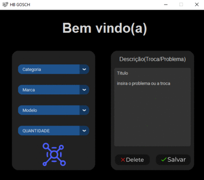

<h1>Relatar e catalogar</h1>

<h2>Bem vindo(ao) meu repositório</h2>

>Status do projeto: Em Desenvolvimento

## Descrição do projeto
 

Esse projeto foi desenvolvido para uma assistência técnica, com o objetivo de facilitar a visualização rápida e simples dos produtos disponíveis. Através de poucos cliques, é possível selecionar a categoria, marca, nome e modelo do produto desejado. Além disso, o projeto permite catalogar novos produtos e relatar problemas relatados pelos clientes. Tudo isso é feito com integração direta aos dados de uma planilha.

    
## Funcionalidades

:heavy_check_mark: `Funcionalidade 1:` selecionar categoria e marca etc

:heavy_check_mark: `Funcionalidade 2:` fazer registro ou relatar um problema 
 
:heavy_check_mark: `Funcionalidade 3:` salvar os dados do cliente em uma planilha

:heavy_check_mark: `Funcionalidade 4:` catalogar produtos
 
:heavy_check_mark: `Funcionalidade 5:` ver quantidades dos produtos filtrando pela categoria/marca/modelo
        
<video width="420" height="340" controls="controls">
    <source src="./filme.mp4" type="video/mp4">
</video>
 

    <h1>Aplicação<h1>
    

            
## Ferramentas utilizadas

### Você também me encontra em:
&nbsp;&nbsp;
&nbsp;&nbsp;
 
<h2>Guia</h2>

para rodar esse projeto em sua máquina, favor baixar o Banco de dados

>Banco de dados: Data

Logo após ter baixado, baixe a pasta de mídia do projeto

>Pasta: fotos
